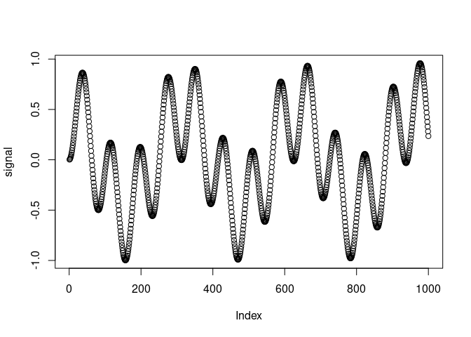
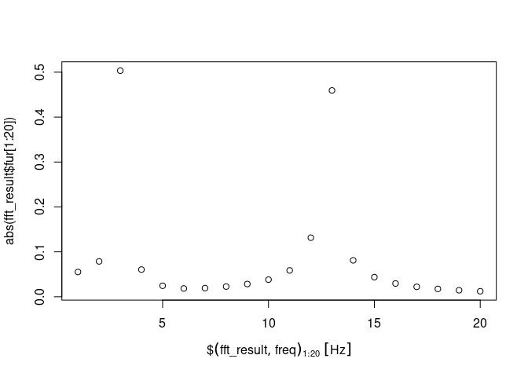
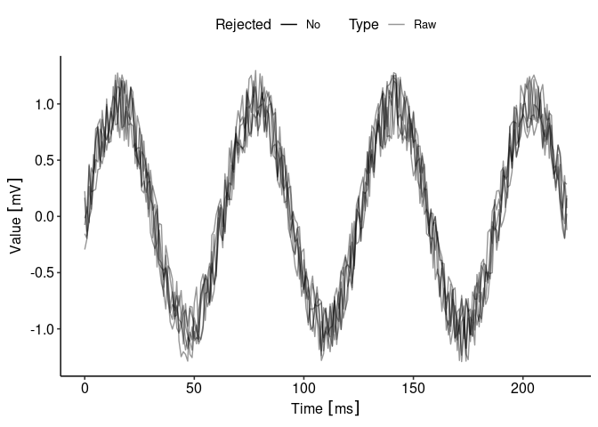
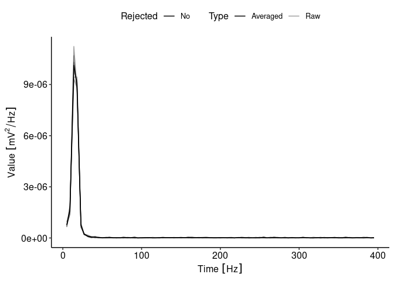

<!-- README.md is generated from README.Rmd. Please edit that file -->

# EPhysMethods R Package

<!-- badges: start -->
<!-- badges: end -->

The EPhysMethods package contains helper functions and methods
frequently used with electrophysiological data (filters, outlier
detection, Fourier transform)

## Installation

You can install the development version of EPhysMethods from
[GitHub](https://github.com/) with:

``` r
if (!requireNamespace("remotes", quietly = TRUE)){
  install.packages("remotes")
}
remotes::install_github("moritzlindner/EPhysMethods")
```

Note that `EPhysMethods` recommends the github-deposited R Package
`EPhysData`. Installation usually works automatically. Updating, however
may fail. If this is the case, update manually using the following line
of code:

``` r
remotes::install_github("moritzlindner/EPhysData")
```

## Example

This is a basic example which shows you how to solve a common problem:

``` r
library(EPhysMethods)
## fast Fourier transform
library(units)
signal<-sin((1:1000)/33)*sin((1:1000)/20)
plot(signal)
```



``` r
fft_result <- fastfourier(signal, samp.freq = as_units(1000,"Hz"))
plot(fft_result$freq[1:20],abs(fft_result$fur[1:20]))
```



``` r

## Get spectral power
require(EPhysData)
X<-makeExampleEPhysData()
ggEPhysData(X)
#> Warning in GetData(x, Raw = Raw): Averaging function function (x) { x} returns more than a single value per time point. Has a valid function been set? Try e.g.: AverageFunction(X)<-mean
#> Warning in ggEPhysData(X): No averaging function set.
```



``` r
psd<-PSD(X)
ggEPhysData(psd)
```



``` r

## identify most dissimilar columns 
data <- matrix(data = c(1, 2, 3, 4, 5, 6, 7, 8, 9), ncol = 3)
rejected <- autoreject.by.distance(data, threshold = 1)
```
